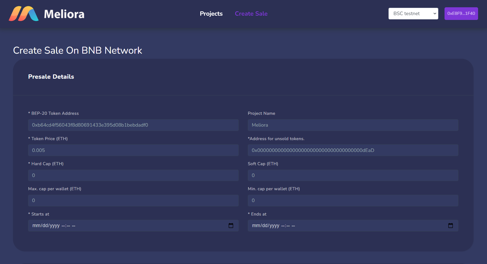
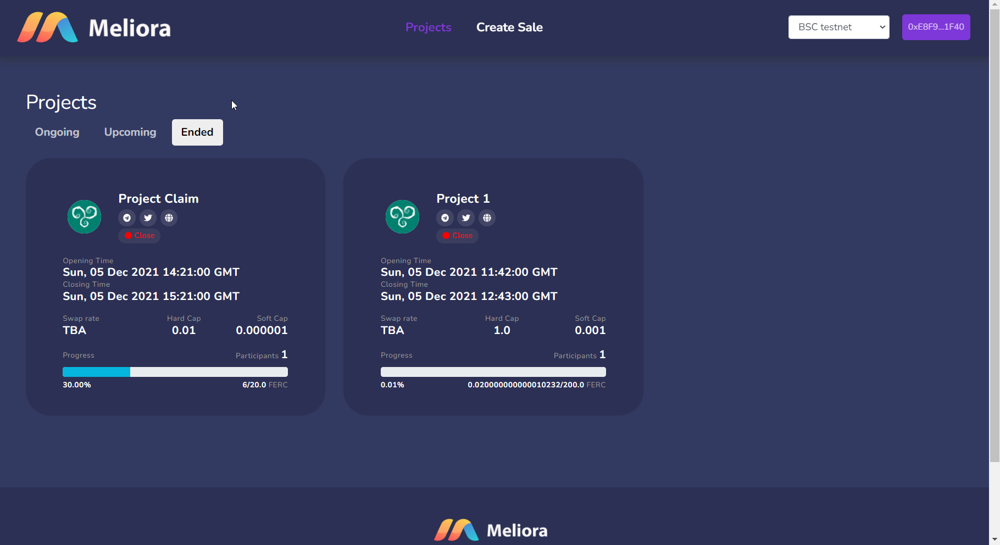
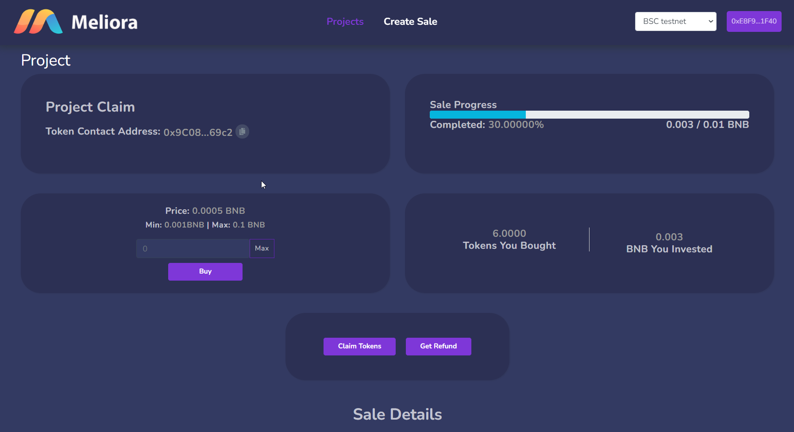

# Meliora 

Meliora is a Decentralized pre-sale platform with the lowest fee and no native token barrier for 
PancakeSwap/ Uniswap.

## Contract address
<p>MelioraInfo: 0x44882E570152cD4c68b53a9FF6dB58F03197e869</p>
<p>MelioraFactory: 0xd8111B92C3F969992e829d10DeE461693B2f569E</p>

## Migration file
```
const MelioraInfo = artifacts.require("MelioraInfo");
const MelioraFactory = artifacts.require("MelioraFactory");
const MelioraLaunchpad = artifacts.require("MelioraLaunchpad");
const FaucetERC20 = artifacts.require("FaucetERC20");

module.exports = async function (deployer, network, accounts) {
  console.log(accounts);
  await deployer.deploy(MelioraInfo);
  const melioraInfo = await MelioraInfo.deployed();
  const melioraInfoAddress = melioraInfo.address;
  await deployer.deploy(MelioraFactory, melioraInfoAddress);
  const melioraFactoryInstance = await MelioraFactory.deployed();
};

```


## Roadmap

- Create Pre-sale of project

- Invest in project

- Claim token

- Get Refund


### Create Pre-sale



In this page new sale of project is creates. 
This form is divided into four section.

- Presale general details
```
    1. BEP-20/ERC Token Address: address of ERC20/BEP-20 token
    2. Project Name: Title of project
    3. Token Price (ETH/BNB): Price of each token in ETH/BNB
    4. Address for unsold tokens: 
    5. Hard Cap (ETH):
    6. Soft Cap (ETH): 
    7. Max. cap per wallet (ETH): Maximum allowed investment for each address
    8. Min. cap per wallet (ETH): Minimum allowed investment for each address
    9. Starts at: Opening time of sale
    10.Ends at: Closing time of sale
```
- Whitelisted addresses
```
    1. Whitelisted Addresses (Comma-separated): Multiple addresses with comma(',') separated 
```
- PancakeSwap/Uniswap Liquidity Allocation
```
    1. Listing Price (ETH): Listing price at exchange for each token
    2. PancakeSwap/Uniswap LP Allocation: %of allocation in exchange
    3. Listing Time: Time at which token listed in exchange
    4. PancakeSwap LP Tokens Lock Duration (Days): Duration of token in days
```
- Project's social media account
```
    1. Website: URL of project's website
    2. Telegram: Telegram link
    3. Discord: Discord link
    4. Twitter: Twitter link
```
In this page there are two transaction will be initialed. first approve and second create new sale.


### List of projects



### Projects details


There are three transaction in this page 

- Buy
- Claim token
- Get Refund


